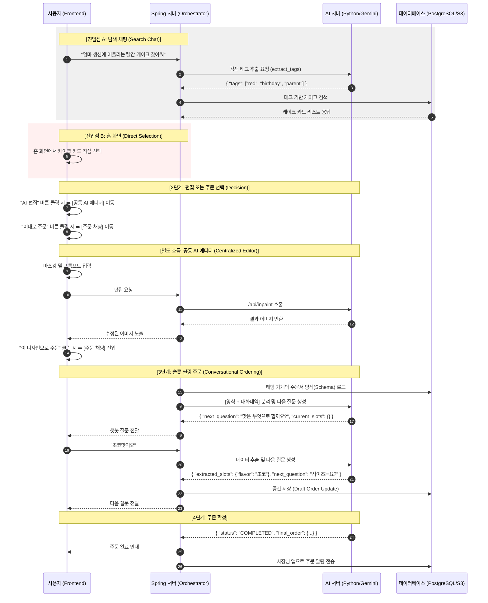
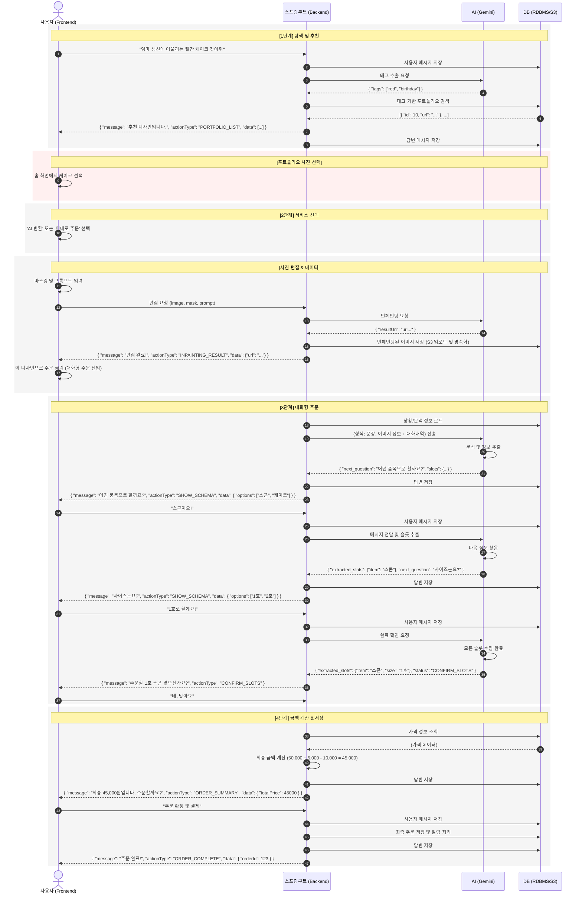

# 🌊 MakeAWish-AI 대화형 주문 플로우 및 상세 작업 가이드 (Graduation Project Edition)

본 문서는 프론트엔드, Spring 서버, AI 서버 간의 상호작용을 정의한 시퀀스 다이어그램 및 졸업 작품 완성을 위한 최종 기술 명세서입니다.

---

## 1. [v1] 초기 시퀀스 다이어그램 (Concept Model)



---

## 2. [v2] 고도화된 시퀀스 다이어그램 (Implementation Model)



---

## 3. v1 vs v2 차이점 및 변화 분석

### 🌟 잘 된 점 (Improvements)

- **데이터 응답 구조화**: `actionType`과 `data` 필드를 도입하여 프론트엔드가 상황에 맞는 UI(버튼, 카드 등)를 동적으로 렌더링할 수 있게 됨.
- **비즈니스 로직의 명확화**: 금액 계산과 같은 핵심 로직을 AI가 아닌 백엔드(Spring)가 담당하게 하여 데이터의 정확성과 신뢰성을 확보함.
- **데이터 영속성 강화**: 매 대화 단계마다 DB 저장을 명시하여 장애 복구 및 대화 맥락 유지 능력을 향상시킴.

### 💡 향후 구현 시 보완점 (Technical Deep Dive)

- **DB 저장소의 이원화**: RDBMS(텍스트 데이터)와 S3(이미지 파일)를 물리적으로 분리하여 저장 및 관리.
- **이미지 영속화 처리**: AI 서버가 생성한 임시 URL 이미지를 서비스 전용 S3 버킷으로 재업로드하여 유효기간 만료 문제 방지.
- **예외 상황 대응(Fallback)**: 사용자의 이탈 답변이나 AI의 인식 오류 시 백엔드에서 선택지를 다시 제시하는 등의 방어적 로직 구현.
- **컨텍스트 연결**: AI 에디터에서의 작업 결과(이미지 ID 등)를 주문 세션으로 자연스럽게 전달하는 구조 설계.

---

## 4. 서버별 핵심 역할

### 🛠 Spring 서버 (The Manager)

- **진입점 및 오케스트레이션**: 탐색 채팅, 홈 화면 유입 관리 및 전체 주문 상태 머신 제어.
- **상태 및 데이터 관리**: 사용자가 선택한 케이크 정보 매칭, 가게별 주문서 스키마 보관, AI 추출 데이터의 DB 영속화.
- **파일 서비스**: 생성된 시안을 S3에 업로드하고 URL을 관리.

### 🤖 AI 서버 (The Brain)

- **태그 추출 (Tagging)**: 검색 키워드 및 사용자 의도 추출.
- **슬롯 필링 (Slot-filling)**: 대화형 인터페이스를 위한 데이터 추출 및 다음 질문 생성.
- **이미지 생성 (Inpainting)**: 에디터 페이지에서 이미지 수정 및 결과 반환.

### 📱 프론트엔드 (The Interface)

- **멀티 엔트리 홈 화면**: 탐색 채팅과 카드 리스트 그리드 뷰의 유기적 배치.
- **동적 UI 컴포넌트**: `actionType`에 따른 AI 에디터, 주문 채팅창, 결과 카드 등의 전역적 재활용.

---

## 5. 파트별 상세 작업 리스트 (Detailed Task List)

### 🤖 AI 서버 파트 (Python/FastAPI)

1. **검색 엔진 고도화 (`/api/ai/tags`)**
   - [x] 유저 문장에서 `색상`, `상황`, `대상`, `스타일` 키워드를 분리하는 전용 프롬프트 작성.
   - [x] 결과값을 항상 `list` 포맷의 JSON으로 반환하도록 제약 설정.
2. **주문 슬롯 필링 엔진 (`/api/ai/order-filling`)**
   - [x] **Context 관리**: Spring에서 넘어온 대화 내역을 결합하여 문맥을 파악.
   - [x] **필수 항목 체크**: 주문서 JSON(Schema)과 비교하여 비어있는 Key값을 탐색.
   - [x] **질문 생성**: 자연스럽고 친절한 점원 페르소나 적용.
3. **인페인팅 서버 최적화 (`/api/inpaint`)**
   - [ ] Gemini 3.1 Flash의 인페인팅 파라미터 튜닝 및 결과 이미지 품질 고도화.

### 🛠 Spring 서버 파트 (Java/Spring Boot)

1. **데이터베이스(JPA/RDBMS) 설계**
   - [ ] `CakePortfolio`: 이미지 URL, 태그 리스트 저장.
   - [ ] `OrderSchema`: 가게별 커스텀 주문서 양식(JSON) 저장.
   - [ ] `ChatMessage`: 대화 내역 및 주문 진행 상태 저장.
2. **AI 서버 연동 모듈 (WebClient)**
   - [ ] FastAPI 서버와의 비동기 통신 및 예외 처리 로직 구현.
3. **오케스트레이션 로직**
   - [ ] `actionType` 기반의 응답 생성 및 주문 슬롯 실시간 업데이트 로직.
4. **이미지 저장소(S3) 연동**
   - [ ] 외부 이미지를 S3에 업로드하고 영속 URL을 관리하는 파일 서비스.

### 📱 프론트엔드 파트 (TypeScript/React Native)

1. **대화형 UI 개발**
   - [ ] 채팅창 UI 및 AI 추천 결과 가로 스크롤 카드 뷰.
2. **AI 캔버스 에디터 (Centralized Editor)**
   - [ ] 이미지 위 마스킹(그리기) 및 영역 추출 로직 구현.
3. **상태 관리 및 연동**
   - [ ] 주문서 작성 현황 관리 및 Spring 서버 API 연동.

---

## 6. 데이터 흐름 표준 규격 (API Interface)

### A. 검색 태그 추출 (Spring ➡️ AI)

- **Request**: `{ "query": "..." }`
- **Response**: `{ "tags": ["tag1", "tag2"] }`

### B. 슬롯 필링 질문 (Spring ➡️ AI)

- **Request**: `{ "schema_json": {...}, "messages": [...], "current_message": "..." }`
- **Response**: `{ "extracted_slots": {...}, "next_question": "...", "status": "..." }`

### C. 프론트엔드 응답 규격 (Spring ➡️ Frontend)

```json
{
  "message": "질문 내용",
  "actionType": "PORTFOLIO_LIST | SHOW_SCHEMA | CONFIRM_SLOTS | ORDER_SUMMARY | ...",
  "data": { ... }
}
```

---
*최종 업데이트: 2026-05-02*
