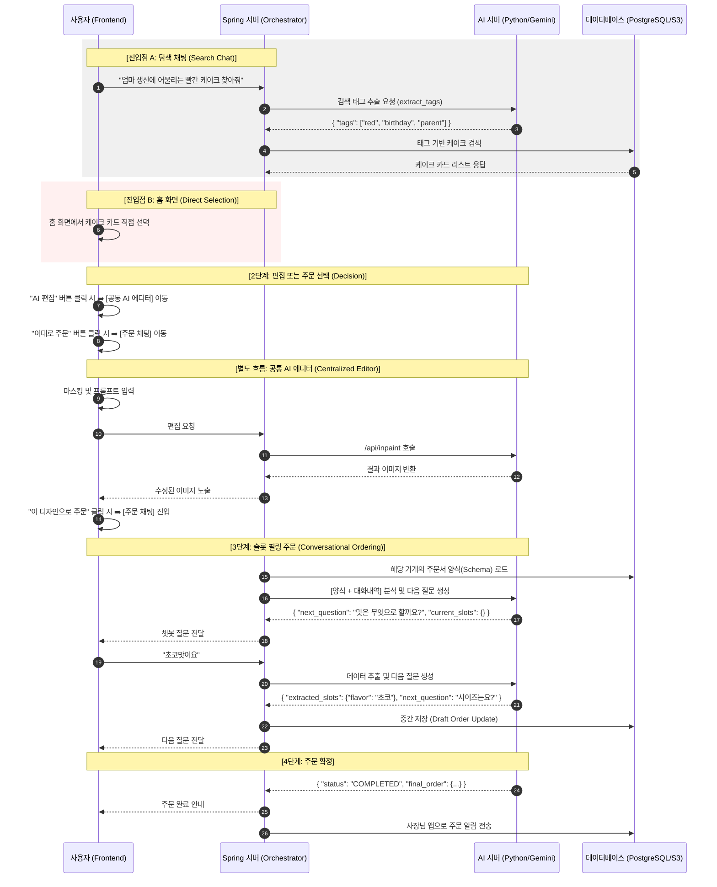

# 🌊 MakeAWish-AI 대화형 주문 플로우 및 상세 작업 가이드 (Graduation Project Edition)

본 문서는 프론트엔드, Spring 서버, AI 서버 간의 상호작용을 정의한 시퀀스 다이어그램 및 졸업 작품 완성을 위한 최종 기술 명세서입니다.

## 1. 전체 시퀀스 다이어그램 (Mermaid)

## 2. 서버별 핵심 역할

### 🛠 Spring 서버 (The Manager)

- **진입점 관리**: 탐색 채팅을 통한 유입과 홈 화면 직접 유입을 모두 수용.
- **상태 제어**: 사용자가 선택한 케이크 정보를 바탕으로 주문서 양식을 매칭하고 흐름을 유도.
- **데이터 관리**: AI가 추출한 태그로 DB 검색, 가게별 주문서 스키마 보관 및 전달.

### 🤖 AI 서버 (The Brain)

- **태그 추출 (Tagging)**: 진입점 A(채팅)에서 검색 키워드를 추출.
- **슬롯 필링 (Slot-filling)**: 3단계 주문 과정에서 대화형 인터페이스 제공.
- **이미지 생성 (Inpainting)**: 에디터 페이지에서 이미지 수정 수행.

### 📱 프론트엔드 (The Interface)

- **멀티 엔트리 홈 화면**: 탐색 채팅과 카드 리스트 그리드 뷰를 유기적으로 배치.
- **공통 UI 컴포넌트**: AI 에디터와 주문 채팅창을 전역에서 재활용.

## 3. 파트별 상세 작업 리스트 (Detailed Task List)

### 🤖 AI 서버 파트 (Python/FastAPI)

1. **검색 엔진 고도화 (`/api/ai/tags`)**
   - [ ] 유저 문장에서 `색상`, `상황`, `대상`, `스타일` 키워드를 분리하는 전용 프롬프트 작성.
   - [ ] 결과값을 항상 `list` 포맷의 JSON으로 반환하도록 제약 설정.
2. **주문 슬롯 필링 엔진 (`/api/ai/order-filling`)**
   - [ ] **Context 관리**: Spring에서 넘어온 대화 내역을 결합하여 문맥을 파악.
   - [ ] **필수 항목 체크**: 주문서 JSON(Schema)과 비교하여 비어있는 Key값을 탐색.
   - [ ] **질문 생성**: 자연스럽고 친절한 점원 페르소나 적용.
3. **인페인팅 서버 최적화 (`/api/inpaint`)**
   - [ ] Gemini 3.1 Flash의 인페인팅 파라미터 튜닝 및 결과 이미지 품질 고도화.

### 🛠 Spring 서버 파트 (Java/Spring Boot)

1. **데이터베이스(JPA/RDBMS) 설계**
   - [ ] `CakePortfolio`: 이미지 URL, 태그 리스트 저장.
   - [ ] `OrderSchema`: 가게별 커스텀 주문서 양식(JSON) 저장.
   - [ ] `ChatSession`: 대화 내역 및 주문 진행 상태 저장.
2. **AI 서버 연동 모듈 (WebClient)**
   - [ ] FastAPI 서버와의 비동기 통신 및 예외 처리 로직 구현.
3. **오케스트레이션 로직**
   - [ ] AI 태그 기반 DB 검색 및 주문 슬롯 실시간 업데이트 로직.
4. **이미지 저장소(S3) 연동**
   - [ ] 생성된 시안을 S3에 업로드하고 URL을 관리하는 파일 서비스.

### 📱 프론트엔드 파트 (TypeScript/React Native)

1. **대화형 UI 개발**
   - [ ] 채팅창 UI 및 AI 추천 결과 가로 스크롤 카드 뷰.
2. **AI 캔버스 에디터 (Centralized Editor)**
   - [ ] 이미지 위 마스킹(그리기) 및 영역 추출 로직 구현.
3. **상태 관리 및 연동**
   - [ ] 주문서 작성 현황 관리 및 Spring 서버 API 연동.

## 4. 데이터 흐름 표준 규격 (API Interface)

### A. 검색 태그 추출 (Spring ➡️ AI)

- **Request**: `{ "query": "..." }`
- **Response**: `{ "tags": ["tag1", "tag2"] }`

### B. 슬롯 필링 질문 (Spring ➡️ AI)

- **Request**: `{ "schema_json": {...}, "messages": [...], "current_message": "..." }`
- **Response**: `{ "extracted_slots": {...}, "next_question": "...", "status": "..." }`

---
*최종 업데이트: 2026-05-01*
