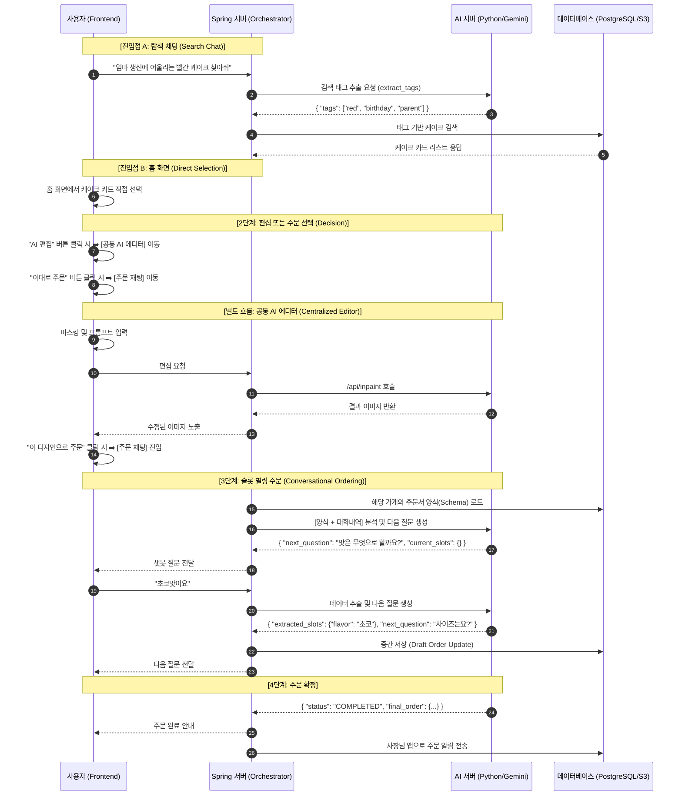
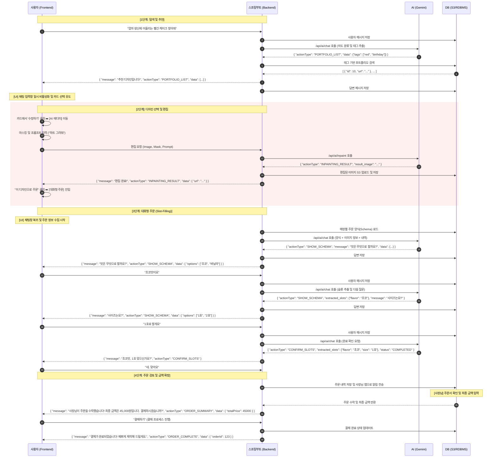

# 🌊 MakeAWish-AI 대화형 주문 플로우 및 상세 작업 가이드 (Graduation Project Edition)

본 문서는 프론트엔드, Spring 서버, AI 서버 간의 상호작용을 정의한 시퀀스 다이어그램 및 졸업 작품 완성을 위한 최종 기술 명세서입니다.

---

## 1. [v1] 초기 시퀀스 다이어그램 (Concept Model)

---

## 2. [v2] 통합 및 고도화된 시퀀스 다이어그램 (Implementation Model)

---

## 3. v1 vs v2 차이점 및 변화 분석

### 🌟 잘 된 점 (Improvements)

- **통합 API 구조 반영**: 모든 텍스트 기반 인터랙션을 `/api/ai/chat` 하나로 처리하여 관리가 용이해짐.
- **데이터 응답 구조화**: `actionType`과 `data` 필드를 도입하여 프론트엔드가 상황에 맞는 UI(버튼, 카드 등)를 동적으로 렌더링할 수 있게 됨.
- **비즈니스 로직의 명확화**: 금액 계산과 같은 핵심 로직을 AI가 아닌 백엔드(Spring)가 담당하게 하여 데이터의 정확성과 신뢰성을 확보함.
- **데이터 영속성 강화**: 매 대화 단계마다 DB 저장을 명시하여 장애 복구 및 대화 맥락 유지 능력을 향상시킴.

### 💡 향후 구현 시 보완점 (Technical Deep Dive)

- **DB 저장소의 이원화**: RDBMS(텍스트 데이터)와 S3(이미지 파일)를 물리적으로 분리하여 저장 및 관리.
- **이미지 영속화 처리**: AI 서버가 생성한 임시 이미지를 서비스 전용 S3 버킷으로 재업로드하여 유효기간 문제 방지.
- **예외 상황 대응(Fallback)**: 사용자의 이탈 답변이나 AI의 인식 오류 시 백엔드에서 선택지를 다시 제시하는 등의 방어적 로직 구현.

---

## 4. 서버별 핵심 역할

### 🛠 Spring 서버 (The Manager)

- **진입점 및 오케스트레이션**: 탐색 채팅, 홈 화면 유입 관리 및 전체 주문 상태 머신 제어.
- **상태 및 데이터 관리**: 사용자가 선택한 케이크 정보 매칭, 가게별 주문서 스키마 보관, AI 추출 데이터의 DB 영속화.
- **파일 서비스**: 생성된 시안을 S3에 업로드하고 URL을 관리.

### 🤖 AI 서버 (The Brain)

- **통합 텍스트 분석**: `/api/ai/chat`을 통한 태그 추출, 슬롯 필링, 의도 분류.
- **이미지 생성 (Inpainting)**: 에디터 페이지에서 이미지 수정 및 결과 반환.

### 📱 프론트엔드 (The Interface)

- **동적 UI 컴포넌트**: `actionType`에 따른 AI 에디터, 주문 채팅창, 결과 카드 등의 유기적 배치.
- **상태 관리**: 채팅 일시 정지 및 카드 선택 유도 등 사용자 인터랙션 관리.

---
*최종 업데이트: 2026-05-07*
